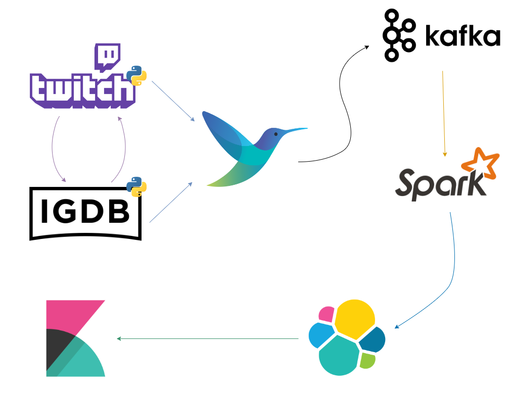
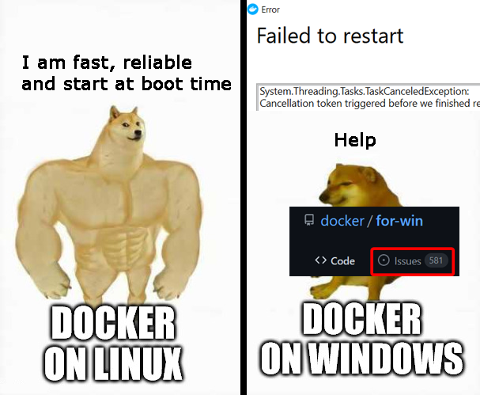
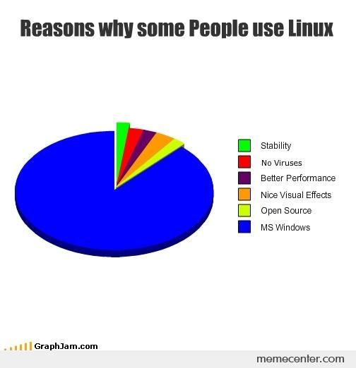
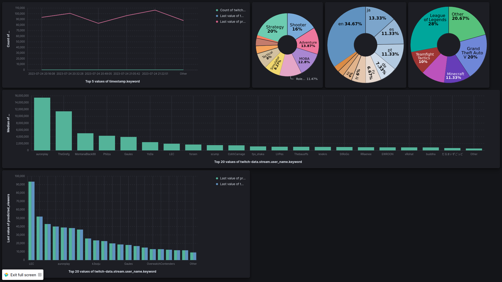

# How to use it?
You cant use it im sorry.

It wont work anything, thats too old but you can try
```
docker compose up
```
and go to
```
localhost:5601
```


# Tap Twitch : Predicting viewers of twitch streamers
- Carmelo Fuccio 
- A.A 2022/2023
- Project of Technlogies for Advanced Programming (TAP)

  


# How it works
TapTwitch is a enviroment that works with IGBD Api and Twitch API, to obtain combined data's about the platform called 'Twitch' and basic information about the games streamed in the streaming platform.
Basically we're using softwares that let's us manipulate and elaborate and show the data's we're receving.

# The pipeline


# <span style="color: purple"> :one: Docker </span>
**Docker is the core of this project**
It is a containerization platform that allows you to create, deploy, and manage application containers. Containers are isolated and portable environments containing all the dependencies required to run the application, including code, libraries, and configurations.

<div style="display: flex;">
    <div style="flex: 1;">
        
    </div>
    <div style="flex: 2;">
        
    </div>
</div>

# <span style="color: purple">:two:API'S  </span>

**The twitch api is annoying**
It requires 4 different tokens/auth IDs. So, we made a Python script that does (almost) everything.
We retrieved a lot of data elements, such as game rating, game genres, viewers, follower counts, and more.

I merged it with IGBD game to get some more statistic values about the games.

# <span style="color: purple">3️⃣ Fluentbit : lightweight baby </span>


- Lightweight and Resource-Friendly : known for its low memory and CPU usage.
- Performance: Due to its lightweight nature, Fluent Bit can handle high volumes of log data efficiently, making it a good choice for processing logs in real-time and at scale.
- Simplicity and Ease of Configuration: designed with semplicity offering an easy-to-use configuration format and straightforward setup process. It can be quickly deployed and configured.

# <span style="color: purple">:four: Kafka: the data streaming</span>


Kafka is used to stream data through topics that is receving from fluent-bit.
Zookeeper is crucial to Kafka as it serves as a distributed coordination service, managing Kafka brokers' metadat and handling partitions and topic.

# <span style="color: purple">:five: Spark: suffering a lot </span>

Apache Spark is an open-source distributed computing system that offers high-speed data processing and analytics.
We used the Spark MLIB library, using linear regression, a machine learning algorithm that does the prediction and estimate the viewers count about the stream in the platform.


# <span style="color: purple">:six: Elastic search: goin fast</span>


Elasticsearch is a distributed search and analytics engine designed for fast real-time data analysis and visualization. 

Used as a storage in our project, giving fast and efficient search operation.

# <span style="color: purple">7️⃣ Kibana: Cakes and istograms </span>


Kibana is an open-source data visualization platform that works seamlessly with Elasticsearch, allowing us to explore, analyze, and visualize their data through interactive dashboards and charts.



